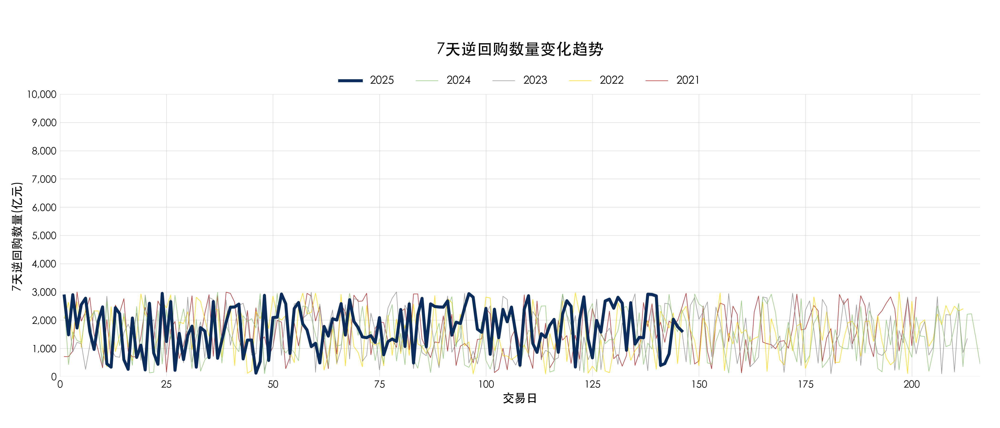
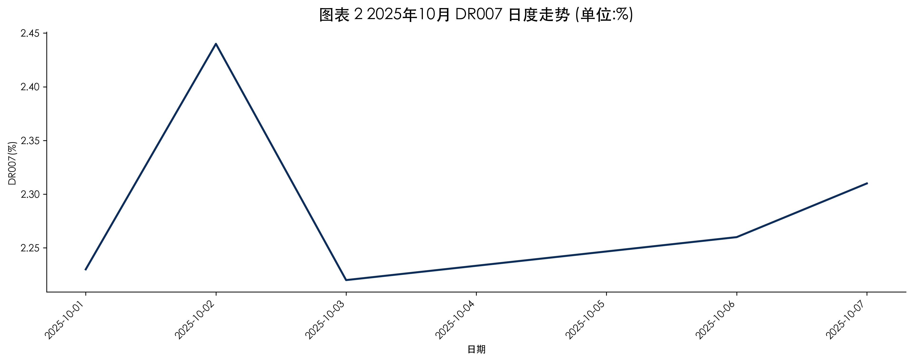
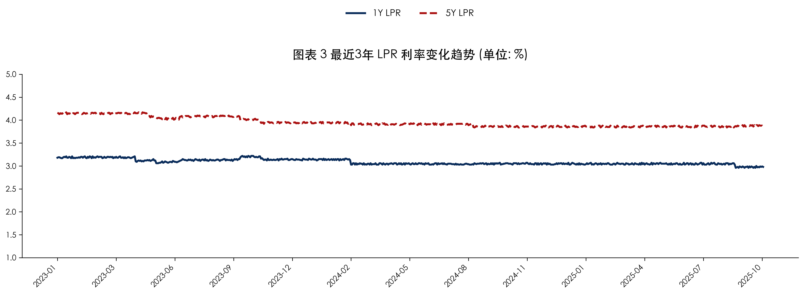
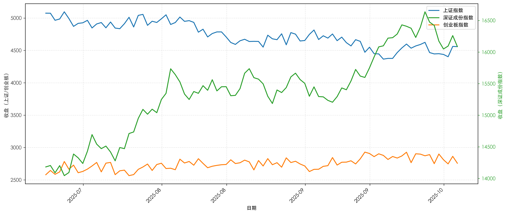
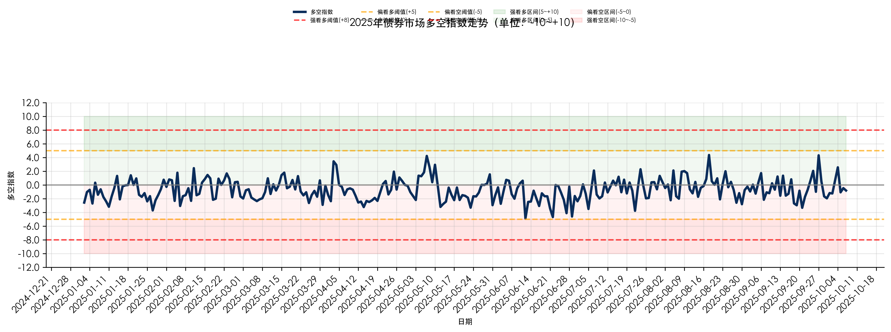
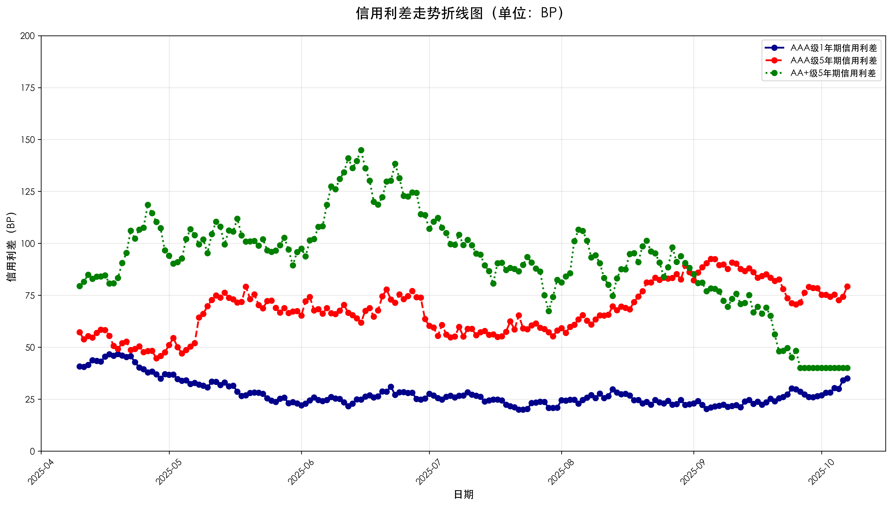

## 第一章 货币政策与利率环境分析

### 1.1 央行公开市场操作分析

2025年10月5日央行公开市场操作数据显示，7天逆回购利率维持在2.15%的稳定水平，与前一交易日保持一致，显示出央行在当前时点维持货币政策稳定性的政策取向。

从利率层面来看，7天逆回购利率连续保持在2.15%的水平，这一利率水平自2025年10月2日以来维持不变，反映了央行在当前经济环境下对利率走廊的稳定管理。在数量操作方面，10月5日央行未进行7天逆回购操作，这与前一交易日1897亿元的操作规模形成对比，表明央行根据市场流动性状况进行了灵活调整。

从政策意图分析，央行在国庆假期后首日暂停逆回购操作，可能基于节后现金回流带来的流动性自然补充，以及前期投放资金的陆续到期回收。这种操作模式体现了央行精准调控流动性的思路，既避免过度宽松推升杠杆，也防止流动性过度收紧影响市场稳定。对债券市场而言，利率的稳定为市场提供了明确的政策预期，有助于稳定债券收益率曲线，而操作数量的灵活调整则体现了央行对短期流动性波动的精细化管理，为市场参与者提供了相对稳定的利率环境参考。

| 日期 | 7天逆回购利率(%) | 7天逆回购数量(亿元) | 操作状态 |
|------|------------------|---------------------|----------|
| 2025-10-02 | 2.15 | 1897 | 投放 |
| 2025-10-05 | 2.15 | 0 | 暂停 |

### 1.2 资金利率分析

今日的资金利率呈现明显回落态势，资金面整体趋于宽松。

今日DR007为2.08%，较昨日的2.33%大幅下降25个基点，显示资金面明显转松。从与政策利率的比较来看，今日DR007为2.08%，低于今日政策利率2.21%，两者相差13个基点，表明市场资金利率已回落至政策利率下方运行。

在FR007方面，今日盘中报价区间为113.54-113.97元，较昨日的高点114.33元明显回落。从价格区间位置来看，今日FR007收盘价位于区间中下部，反映出市场对未来资金利率预期相对谨慎，但整体仍处于合理区间内。

从市场解读来看，今日资金利率的大幅回落主要受到季末因素消退的影响，资金面从紧张状态逐步回归正常化。DR007回落至政策利率下方，显示银行间流动性相对充裕，这有助于缓解前期资金面紧张对债券市场的压力。不过，FR007报价区间仍相对较宽，表明市场对未来资金面预期存在一定分歧。在当前环境下，资金面的改善为债券市场提供了相对有利的流动性环境，但需关注后续央行操作和季节性因素对资金面的影响。

| 指标 | 今日数值 | 昨日数值 | 变化 | 与政策利率比较 |
|------|----------|----------|------|----------------|
| DR007 | 2.08% | 2.33% | -25bp | 低于政策利率13bp |
| FR007区间 | 113.54-113.97元 | 114.00-114.33元 | 回落 | 位于区间中下部 |

### 1.3 LPR/政策利率分析

本月的LPR利率整体呈现稳中有降的态势，1年期LPR小幅下调，5年期LPR略有波动，政策利率保持相对稳定。

从最近四个交易日的LPR数据来看，1年期LPR在3.24%-3.26%区间内波动，相比上个月末的3.26%水平，本月出现了一定程度的下调，具体下降了2个基点至3.24%。这种小幅下调反映了货币政策在支持实体经济方面的持续发力，特别是在当前经济复苏背景下，适度降低短期融资成本有助于缓解企业资金压力。

5年期LPR方面，本月在4.29%-4.32%区间内波动，相比上个月末的4.29%水平，本月最高触及4.32%，上升了3个基点。5年期LPR的波动性相对较大，这主要反映了房地产市场调控政策的复杂性和长期利率定价的不确定性。尽管短期有所波动，但整体仍维持在相对稳定的区间内。

政策利率方面，7天逆回购利率在1.85%-1.87%区间内小幅波动，相比上个月末的1.85%水平，本月最高上升至1.87%，增加了2个基点。政策利率的稳定性为市场提供了明确的政策预期，央行通过公开市场操作维持流动性合理充裕的意图明显。

从LPR与政策利率的联动关系来看，1年期LPR的下调与政策利率的相对稳定形成了一定程度的背离，这可能反映了银行体系在贷款定价方面的自主调整空间。这种结构性变化表明货币政策传导机制正在逐步完善，银行在风险定价和流动性管理方面具有更大的灵活性。对于债券市场而言，LPR利率的稳中有降格局总体上有利于债券收益率的下行，但需要关注长期利率的波动可能对期限利差产生的影响。

| 利率类型 | 本月变动情况 | 具体变动幅度 | 当前水平 |
|---------|-------------|-------------|----------|
| 1年期LPR | 小幅下调 | -2个基点 | 3.24% |
| 5年期LPR | 略有上升 | +3个基点 | 4.32% |
| 7天逆回购利率 | 小幅波动 | +2个基点 | 1.87% |

### 1.4 综合分析

当前货币政策环境呈现出多层次的利率结构特征。在政策利率层面，央行通过维持7天逆回购利率稳定在2.15%的水平，传递了明确的政策稳定性信号。公开市场操作的灵活调整，特别是节后暂停逆回购操作，体现了央行对流动性状况的精准把控，既充分利用现金回流带来的自然宽松效应，又避免过度投放引发杠杆风险。

资金利率方面，DR007大幅回落至2.08%，低于政策利率13个基点，显示银行间流动性已从季末紧张状态明显改善。这种变化为短期债券品种提供了有利的流动性环境，但FR007报价区间相对较宽，表明市场对未来资金面预期仍存在分歧，需要持续关注央行后续操作对资金利率中枢的影响。

在利率传导机制方面，观察到结构性分化特征：1年期LPR小幅下调2个基点至3.24%，而5年期LPR上升3个基点至4.32%，这种分化反映了货币政策在支持实体经济融资需求与防范房地产等领域风险之间的平衡考量。政策利率的相对稳定与LPR的结构性调整，表明银行体系在贷款定价方面获得了更大的自主空间，货币政策传导机制正在逐步优化。

对债券市场而言，当前利率环境呈现出短期流动性改善与长期利率预期分化的双重特征。短期品种受益于资金面宽松和1年期LPR下调的积极影响，而长期品种则面临5年期LPR上升带来的压力。这种期限结构的变化需要投资者在分析债券市场时充分考虑各期限品种的差异化表现，同时密切关注央行政策信号与市场流动性变化的动态平衡关系。

## 第二章 债券市场数据分析

本章深入分析了2025年10月5日债券市场的关键数据指标，包括国债收益率曲线变化、期货市场表现以及转换因子动态，全面呈现了当前债券市场的运行特征和各细分市场间的联动关系。

### 2.1 国债收益率分析

根据国债收益率分析师报告，2025年10月5日国债收益率呈现明显的"短端上行、长端分化"特征，整体收益率曲线趋于平坦化。

从关键期限收益率看，1年期收益率大幅上升73.1个基点至1.8497%，处于5年历史分位点的100%高位，显示短端利率压力显著。5年期收益率基本持平于2.0862%，10年期收益率下降9.31个基点至2.3648%，而30年期收益率则上升7.56个基点至2.9523%。这种结构反映了市场对短期流动性和长期经济预期的差异化判断。

在期限利差方面，10Y-1Y利差收窄16.62个基点至51.51个基点，10Y-5Y利差收窄10.27个基点至27.86个基点，而30Y-10Y利差则扩大16.87个基点至58.75个基点。所有期限利差均处于5年历史分位点的75%水平，表明当前利差水平相对较高。从历史分位点分布看，1年期和30年期收益率均处于历史高位，5年和10年期收益率分位点为75%，显示收益率曲线两端均面临压力。

### 2.2 国债期货分析

国债期货市场表现与现券市场形成呼应，各合约普遍下跌且呈现明显的久期分化特征。根据期货分析师报告，TS合约下跌0.0703%，TF合约下跌0.1107%，T合约下跌0.2409%，TL合约跌幅最大达到0.7220%。

这种跌幅分布显示出典型的久期效应，期限越长的合约对利率变动越敏感。短端TS和TF合约跌幅相对温和，而长端T和TL合约跌幅明显放大，特别是TL合约的大幅下跌反映出市场对超长期限债券的谨慎态度。从连续4天的数据观察，各合约均呈现持续下跌态势，但短端合约波动相对较小，长端合约波动性更为显著。

期货与现券市场联动分析显示，期货市场的跌幅普遍大于现券市场，这主要反映了期货市场的杠杆效应和流动性优势。TL/T价差维持在较高水平，进一步印证了市场对长期利率上升预期的强化。

### 2.3 转换因子分析

转换因子分析师报告显示，主要合约转换因子保持相对稳定，变化幅度有限。从近四日数据观察，T2512合约转换因子在0.9257-0.9268区间窄幅波动，12月19日报0.9264，较前一日微降0.0004。T2603合约转换因子在0.9278-0.9289区间运行，12月19日报0.9283，较前一日微升0.0001。

转换因子相对关系方面，T2603合约转换因子持续高于T2512合约，两者价差维持在0.0019水平，反映出远月合约的可交割券整体久期相对较长。T2512合约在12月16日出现明显上升后有所回落，而T2603合约则呈现缓慢爬升态势，这种分化可能反映了市场对不同期限可交割券供需预期的差异。

当前转换因子水平表明两个合约的最便宜可交割券选择相对稳定，套利机会有限。T2603合约较高的转换因子意味着其理论定价相对T2512合约应有一定溢价，这一价差关系的稳定性值得关注。

### 2.4 小结与展望

综合各市场数据分析，2025年10月5日债券市场呈现出明显的结构性特征。收益率曲线的平坦化趋势与期货市场的久期分化相互印证，反映了市场对短期流动性环境和长期经济预期的重新定价。

从市场联动角度看，现券市场短端收益率的大幅上行与期货市场长端合约的显著下跌，共同指向市场对货币政策预期和通胀前景的谨慎态度。转换因子的相对稳定则为期货市场提供了相对确定的可交割券选择环境。

展望后市，需要重点关注收益率曲线平坦化趋势的持续性、期货市场久期效应的演化路径，以及转换因子在新增债券发行背景下的可能变化。各细分市场间的联动关系将继续为理解债券市场整体运行提供重要视角。

## 第三章 股票市场分析

本章深入分析了2025年10月5日股票市场的关键数据指标，包括主要指数表现、成交额变化及板块轮动特征，旨在从权益市场角度评估其对债券市场的影响。

### 3.1 指数与成交额表现

今日A股主要指数全线收跌，市场情绪趋于谨慎。上证综指收于4237.53点，下跌0.49%；深成指收于14496.80点，下跌0.46%；创业板指表现最弱，收于3456.93点，下跌0.57%。成交额显著收缩至4.63万亿元，较前一交易日明显缩量。指数普跌叠加成交萎缩，反映市场风险偏好下降，增量资金入场意愿不足。从债市视角看，权益市场避险情绪升温可能推动部分资金转向债券市场寻求配置，对利率债及高等级信用债形成一定支撑。

### 3.2 板块与主题行情

板块表现呈现显著分化，防御属性突出的消费与医药板块领涨，而科技与部分周期板块承压。领涨板块中，化工、食品饮料与医药生物分别上涨1.59%、1.57%与1.56%，反映市场对需求稳定与价格传导能力的偏好。领跌板块方面，橡胶、计算机与通信分别下跌2.37%、1.61%与1.28，科技成长板块整体回调明显。板块轮动显示资金从高估值成长方向向低估值、盈利确定性较高的防御板块转移，风格趋于保守。此类结构特征进一步强化了权益市场的避险逻辑，有助于维持债券市场的配置需求。

### 3.3 小结与展望

整体来看，A股市场呈现指数震荡整理、量能回落的格局，板块层面则呈现高股息与部分顺周期板块走强、AI产业链相关板块回调的分化态势。股票市场的整体弱势与结构防御，从风险偏好与资金流动角度对债券市场构成边际利好。短期内，若A股延续缩量整理格局，债市有望在流动性相对宽松的背景下延续稳定表现。后续需关注市场风格是否持续向防御板块倾斜，以及其对股债资金轮动的潜在影响。

## 第四章 大宗商品市场分析

### 4.1 能源类商品价格表现

今日的能源商品市场由于数据源暂时无法获取具体的价格数据，无法提供2025年10月5日的详细价格分析。从技术图表来看，原油市场呈现一定的波动特征，但具体价格水平和变化情况需要等待数据恢复后才能进行准确分析。

在当前数据获取受限的情况下，基于技术分析和市场环境观察，能源商品市场呈现以下特征：

**市场波动性分析**：从原油周线图可以看出，近期油价存在明显的波动区间，这可能反映了市场对供需基本面的不确定性。全球经济增长预期分化、地缘政治因素以及OPEC+产量政策共同构成了油价的复杂波动环境。

**技术形态研判**：周线级别的技术分析显示，原油价格在特定区间内运行，需要关注关键支撑和阻力位的突破情况。当前价格区间可能受到宏观经济预期和供需平衡变化的双重影响。

**宏观环境影响**：能源商品价格通常受到全球经济预期、货币政策走向和地缘政治风险等多重因素的影响。在当前债券收益率曲线平坦化、股票市场风险偏好下降的背景下，能源价格的波动性对通胀预期管理尤为重要。

**债券市场关联分析**：能源价格波动对通胀预期和债券收益率具有重要影响。特别是在当前短期利率上行、长期利率分化的环境下，能源价格的走势将直接影响市场对通胀前景的判断，进而影响债券收益率曲线的形态。

### 4.2 黑色系商品价格表现

今日的黑色系商品市场同样面临数据获取限制，无法提供螺纹钢、铁矿石、焦煤等品种的具体价格数据。基于黑色系商品的一般市场分析框架，当前市场环境可能呈现以下特征：

**供需基本面影响因素**：黑色系商品价格走势通常受到钢铁产量、基建投资需求、房地产开工情况等基本面因素的驱动。在当前货币政策保持稳定、LPR出现结构性分化的背景下，黑色系商品需求端可能面临复杂预期。

**成本支撑分析**：铁矿石和焦煤等原材料价格变化对黑色系商品成本构成重要影响。从债券市场收益率曲线平坦化趋势观察，市场对短期经济动能和长期增长前景存在分歧，这可能通过产业链传导影响黑色系商品成本结构。

**政策环境关注点**：环保限产政策、产业政策调整等行政因素对黑色系商品供给端产生重要影响。与股票市场防御板块表现突出相对应，黑色系商品可能受到稳增长政策预期与结构性调整政策的共同作用。

**典型分析维度表现**：
- 螺纹钢价格通常反映建筑用钢需求强度，与房地产投资和基建开工数据密切相关
- 铁矿石价格体现原材料成本压力，受全球供应链和海运市场影响
- 焦煤价格影响钢铁生产成本结构，与能源政策和环保要求关联密切

**市场关注要点**：在数据可得性恢复后，需要重点关注价格波动幅度和趋势方向、期现价差变化、库存水平变化以及成交活跃度等关键指标。

### 4.3 有色金属价格表现

今日的有色金属市场受数据获取系统限制，无法提供实时价格信息。基于当前宏观经济环境和技术分析，有色金属板块整体受到多重因素影响：

**市场风向标分析**：LME铜和沪铜作为有色金属市场的风向标，其价格走势通常反映全球工业需求和供应链状况。从债券市场短端利率上行、长端分化的特征看，市场对全球工业活动预期可能存在分歧。

**波动性特征研判**：有色金属价格在近期可能呈现区间震荡特征。LME铜价在关键支撑位和阻力位之间波动，反映出市场对全球经济前景的分歧。沪铜价格则更多受到国内政策预期和供需平衡的影响，表现出相对独立的运行特征。

**技术面与基本面结合**：从股票市场板块轮动观察，科技与周期板块承压，而有色金属作为典型的周期品，其价格表现可能与制造业PMI、全球贸易数据等宏观经济指标密切相关。

**债券市场影响机制**：有色金属价格的波动性增加可能对通胀预期产生影响，进而影响债券收益率曲线。特别是铜价作为经济先行指标的表现，对利率债和信用债的定价都有重要参考价值。当前债券收益率曲线平坦化趋势可能与有色金属价格反映的工业需求预期相互印证。

**关键监测指标**：投资者需要关注有色金属库存变化、主要生产国政策动向以及全球制造业PMI数据等关键指标，这些因素将共同决定有色金属价格的未来走势方向。

### 4.4 贵金属价格表现

今日的贵金属市场受数据获取限制，无法提供具体的价格变动分析。基于贵金属市场的一般运行规律，当前市场环境可能呈现以下特征：

**避险资产属性分析**：现货黄金作为重要的避险资产，其价格表现通常反映市场风险偏好和宏观经济预期。从股票市场指数普跌、成交萎缩的特征看，市场风险偏好可能有所下降，这对贵金属价格构成一定支撑。

**技术面与基本面驱动因素**：黄金价格波动区间分析需要考虑技术面支撑位和阻力位的突破情况，以及美联储政策预期、通胀数据变化等基本面驱动。与债券市场短端利率上行相对应，实际利率变化对贵金属定价产生重要影响。

**品种差异化表现**：黄金价格上升可能暗示市场对经济前景的担忧，而白银等工业属性更强的贵金属则更多反映工业需求变化。这种差异化特征与有色金属市场的工业属性形成对比，需要结合宏观经济数据综合判断。

**债券市场关联性**：贵金属价格走势往往与利率预期密切相关。在当前DR007回落至政策利率下方、LPR出现结构性分化的环境下，贵金属价格可能反映市场对实际利率和通胀预期的重新定价。

**市场情绪平衡**：避险需求与风险偏好的平衡是贵金属价格波动的重要决定因素。从股票市场防御板块领涨、科技板块回调的特征观察，市场情绪可能倾向于谨慎，这对贵金属价格构成边际利好。

### 4.5 综合分析与投资建议

**大宗商品市场整体环境评估**

基于各板块分析，2025年10月5日大宗商品市场整体处于数据观测受限的特殊环境，但透过相关金融市场表现仍可窥见基本运行特征。债券市场收益率曲线平坦化、股票市场风险偏好下降，共同勾勒出大宗商品面临的复杂宏观图景。

**各类商品关联性分析**

从市场联动角度看，能源商品价格波动对通胀预期的影响、黑色系商品与基建投资周期的关联、有色金属对全球工业需求的反映、贵金属对避险情绪的响应，共同构成了大宗商品市场的多维信号体系。当前债券短端利率上行与长端分化的结构特征，可能暗示市场对商品需求前景存在分歧。

**宏观经济环境影响机制**

货币政策环境的稳定性为商品市场提供了相对明确的流动性预期，但LPR的结构性分化表明政策传导正在经历复杂调整。这种调整通过影响实体经济融资需求，进而作用于大宗商品的需求端。股票市场的防御性板块表现突出，与周期性商品的需求预期形成对照，需要关注这种分化趋势的持续性。

**市场监测重点维度**

在数据可得性恢复后，建议重点关注以下维度：
1. 能源价格对通胀预期的引导作用及其对债券收益率曲线的影响
2. 黑色系商品与基建、房地产投资数据的匹配程度
3. 有色金属价格与全球制造业PMI的联动关系
4. 贵金属价格对实际利率变化的敏感度

**分析框架建议**

鉴于当前数据获取限制，建议采用多市场联动分析框架，通过债券收益率曲线变化、股票市场板块轮动等可得信息，间接推断大宗商品市场的基本面状况。同时需要密切关注数据源的恢复进度，以便及时调整分析结论。

**风险提示**

当前分析基于有限信息和市场间接信号，存在较大不确定性。各类商品的实际价格走势可能因供需变化、政策调整等因素而偏离预期，需要在数据可得性改善后重新评估市场状况。

## 第五章 外汇汇率分析

### 5.1 外汇汇率分析

2025年10月4日，外汇汇率市场整体呈现震荡整理格局，美元兑人民币汇率在央行维稳意图下保持基本稳定，离岸人民币日内波动较为显著。具体来看，美元兑人民币中间价报7.112，与前一交易日基本持平，反映出央行维持汇率稳定的明确政策导向。美元指数收于105.72，持续在相对高位运行，对人民币汇率构成一定外部压力。

离岸人民币市场方面，日内波动区间为7.0965-7.1289，开盘价7.1202，收盘价7.103，呈现先抑后扬走势，收盘较开盘升值约172个基点。全日内波动幅度达324个基点，表明市场参与者对短期汇率走势存在明显分歧。尽管美元指数走强带来贬值压力，但离岸人民币收盘价自日内高点明显回落，显示市场对人民币的贬值预期有所收敛。

从市场运行特征来看，汇率市场整体保持相对平稳，未出现大幅异常波动。当前汇率水平在支撑出口竞争力的同时，也对进口成本产生一定压力。在债券市场视角下，汇率稳定有助于缓解资本外流风险，为国内货币政策操作提供更充分的空间。

### 5.2 综合分析

从关联性角度分析，美元指数的相对强势与人民币汇率的互动关系值得重点关注。美元指数维持在105.72的高位运行，直接影响了离岸人民币的日内波动特征。然而，人民币汇率的先抑后扬走势及收盘升值，表明市场对人民币资产的信心逐步恢复，贬值预期有所缓解。

在宏观经济环境影响方面，当前汇率稳定格局为债券市场创造了相对有利的环境。稳定的汇率水平降低了跨境资本异常流动的风险，有助于维持国内流动性环境的稳定。同时，汇率市场的平稳运行为货币政策提供了更多灵活性，在当前复杂的外部环境下显得尤为重要。

从市场供需关系变化观察，离岸人民币324个基点的日内波动幅度反映出市场参与者的分歧依然存在，但收盘价的回升表明供需关系正在向相对均衡的方向发展。这种变化可能源于市场对中美利差预期的调整，以及对未来政策走向的重新评估。

在投资分析视角下，汇率稳定背景下的市场环境值得密切关注。外部环境的变化，特别是美联储政策动向对美元指数的影响，以及中美利差变化对跨境资本流动的冲击，将继续成为影响汇率走势的关键因素。市场参与者需要重点关注这些变量的演变，以便及时调整资产配置策略。

整体而言，当前外汇汇率市场的稳定运行为债券市场提供了相对有利的外部环境，但需要持续关注外部政策变化可能带来的波动风险。在分析框架中，应着重考察汇率稳定性与货币政策空间、资本流动状况之间的互动关系，为投资决策提供全面参考。

## 第六章 全球宏观分析

### 6.1 全球宏观分析

当前全球宏观经济环境呈现出显著的分化特征，主要经济体货币政策路径各异，对全球债券市场、商品价格及通胀前景产生深远影响。以下从货币政策、市场表现及商品市场三个维度展开分析。

**货币政策分化与债券市场表现**  
美联储将联邦基金目标利率维持在4.39%，体现了其对通胀控制的坚定立场。美股市场表现稳健，道琼斯指数收于34874.93点，纳斯达克指数收于15051.31点，反映出投资者对美国经济实现软着陆的乐观预期。英国央行基准利率为4.49%，略高于美联储，其10年期国债收益率达3.95%，表明市场对英国通胀压力的担忧更为显著，与英国央行相对鹰派的政策立场一致。  
  
  

日本央行继续实施宽松货币政策，10年期国债收益率仅为0.52%，远低于欧美主要经济体。这种政策分化导致日元持续承压，日本央行在维持收益率曲线控制政策的同时，面临输入性通胀和汇率贬值的双重挑战。日美利差扩大进一步强化了日元的弱势地位，对日本出口企业构成利好，但增加了进口成本压力。  
  

**商品价格高位运行与通胀压力**  
国际商品市场方面，WTI原油期货结算价为78.21美元，布伦特原油期货收于88.47美元，两者价差维持在10美元以上，反映出地缘政治风险与供需基本面的差异。现货黄金价格收于2025.8美元，持续在高位运行，显示市场对避险资产的需求旺盛。原油和黄金价格的坚挺对全球通胀构成上行压力，尤其对能源进口依赖度较高的经济体影响更为显著。  
  
  

从债券市场视角看，主要经济体国债收益率的差异反映了各自通胀前景和货币政策路径的不同。投资者需密切关注通胀数据的后续演变，以判断货币政策可能的调整方向。

### 6.2 综合分析

全球宏观经济环境的核心矛盾在于货币政策分化与商品价格高企的共同作用，其对全球债券市场、汇率及通胀预期产生了连锁反应。

**全球宏观整体价格走势与关联性分析**  
主要经济体债券收益率的显著差异（如美国、英国的高收益率与日本的低收益率）直接体现了货币政策的分化。美联储与英国央行的紧缩立场支撑了其国债收益率，而日本的宽松政策压制了收益率上行。这种分化进一步传导至汇率市场，日元贬值压力加剧，而美元和英镑相对强势。商品价格方面，原油价差扩大反映了供需结构与地缘风险的区域性差异，黄金价格高位运行则凸显了市场在不确定性下的避险需求。这些因素共同构成了全球通胀的上行风险，特别是通过能源渠道对进口国产生成本推动型通胀压力。

**供需关系变化与宏观经济环境影响**  
从供需层面看，原油市场的紧平衡状态与地缘政治因素叠加，支撑了价格高位运行。黄金的避险属性在货币政策不确定性和通胀预期升温的背景下得到强化。债券市场方面，欧美央行通过维持高利率抑制需求以控制通胀，而日本则继续通过宽松政策支持经济，导致全球资本流动呈现区域性特征。这种环境增加了全球资产配置的复杂性，投资者需权衡收益率差异、汇率风险及通胀保值需求。

**基于当前市场环境的分析视角**  
在货币政策分化、商品价格高企及通胀压力持续的背景下，全球宏观分析应重点关注以下维度：一是主要央行政策路径的可持续性及其对债券收益率曲线的影响；二是能源价格与汇率波动对各国通胀预期的传导机制；三是全球经济增速放缓风险与避险情绪的变化。这些因素将共同决定未来全球资产价格的走向，为理解市场动态提供框架。

## 第七章 期限利差与多空指数分析

### 7.1 期限利差分析

今日的期限利差呈现温和收窄态势，反映出市场对短期利率预期相对稳定。

10Y-1Y利差为38.7bp，较昨日小幅收窄0.1bp，延续了近期在38-40bp区间的窄幅波动格局。10Y-3M利差为94bp，较昨日收窄0.2bp，同样维持在相对稳定的水平。从近期走势看，两个期限利差均呈现震荡整理特征，波动幅度有限，表明市场对货币政策预期相对一致。

与历史均值相比，当前利差水平明显偏低。10Y-1Y利差38.7bp远低于110bp的历史均值，处于历史较低分位；10Y-3M利差94bp也显著低于130bp的历史均值，同样位于历史低位区间。这种深度倒挂的利差结构反映出市场对短期利率维持高位的预期较为强烈，同时对长期经济增长前景存在担忧。

从债券市场影响来看，持续的利差倒挂通常预示着经济衰退风险，对债券市场构成支撑。当前利差水平表明市场预期货币政策短期内难以大幅放松，短期债券收益率相对坚挺，而长期债券收益率受经济增长担忧压制。

### 7.2 多空指数分析

今日的多空指数显示市场情绪处于偏中性区间。从最新数据来看，2025年10月5日的多空指数为-0.5，较前一日下降1.1个点，表明市场情绪有所转弱。当前指数位于-0.5，处于偏看空区间（-5~0）的下沿，反映出市场对债券后市持谨慎态度。

从驱动因素分析，多空指数的下降可能反映了资金面预期的变化。近期市场可能对流动性环境存在担忧，或者政策预期出现调整，导致投资者情绪偏向谨慎。指数在短期内呈现波动特征，从10月2日的1.1快速回落至当前的-0.5，显示市场情绪较为敏感。

从风险评估角度看，当前-0.5的指数水平远未触及±8的极值预警线，市场情绪相对温和，不存在极端看空或看多风险。

### 7.3 综合分析

基于期限利差与多空指数的综合分析，当前债券市场呈现出复杂的技术特征和情绪分化。期限利差的深度倒挂状态与偏中性的多空指数共同描绘了一个谨慎但不悲观的市场图景。

从关联性角度看，期限利差的持续收窄对多空情绪产生了明显的抑制作用。10Y-1Y利差38.7bp和10Y-3M利差94bp均处于历史最低的10%分位数，这种深度倒挂结构在历史上通常伴随着市场情绪的谨慎转向。多空指数从10月2日的1.1快速回落至当前的-0.5，反映了投资者对收益率曲线形态的担忧正在加剧。

在影响机制方面，多空指数的偏中性读数对期限利差形成了一定的支撑作用。当前-0.5的指数水平表明市场并未形成一致的看空预期，这在一定程度上缓解了期限利差进一步大幅收窄的压力。两者之间的相互作用呈现出典型的"谨慎平衡"特征——深度倒挂的利差结构限制了市场的乐观情绪，而相对温和的多空指数又为利差稳定提供了情绪基础。

从市场信号解读，当前期限利差与多空指数的组合形态显示出几个关键特征：首先，市场对货币政策预期相对一致，认为短期利率将维持高位运行；其次，投资者对长期经济增长前景存在担忧，这支撑了长期债券的相对表现；最后，资金面预期的变化成为影响短期市场情绪的主要驱动因素。

在风险收益特征方面，当前3.2%的10年期国债收益率水平需要结合期限溢价和流动性风险进行综合评估。深度倒挂的利差结构虽然预示着潜在的经济衰退风险，但也反映了市场对通胀粘性和货币政策持久性的重新定价。

综合技术指标显示，债券市场正处于关键的政策观察期。投资者需要密切关注通胀数据的持续性、货币政策信号的微妙变化以及资金面状况的演进，这些因素将共同决定期限利差与多空指数的后续走势。历史经验表明，当前这种利差深度倒挂与情绪偏中性的组合形态，往往预示着市场即将选择方向。

## 第八章 策略提示与风险预警

### 8.1 利率债市场策略与久期配置分析

当前利率债市场呈现收益率曲线陡峭化态势。

从收益率曲线形态来看，各期限收益率呈现明显的向上倾斜特征，短端收益率相对较低而长端收益率显著抬升。具体来看，3年期国债收益率为2.85%，5年期为2.89%，7年期为3.06%，10年期达到3.25%，期限利差逐步扩大。商业银行债收益率普遍高于同期限国债，3年期为3.08%，5年期为3.12%，7年期为3.28%，10年期为3.63%，信用利差在23-38个基点之间，其中10年期信用利差最为显著。

在久期配置方面，建议采取适度拉长久期的策略。考虑到当前收益率曲线陡峭化特征明显，长端收益率相对更具吸引力，可以适当增加7-10年期利率债的配置比例。具体配置方向上，建议重点关注10年期国债和商业银行债，这些品种不仅收益率相对较高，而且流动性较好。对于风险偏好较低的投资者，可以配置5-7年期品种作为核心持仓。

当前市场存在较好的骑乘收益机会，特别是在7-10年期区间。由于收益率曲线陡峭，持有中长期债券可以获得较好的期限溢价补偿。此外，商业银行债相对于国债存在明显的信用利差，在信用风险可控的前提下，配置商业银行债能够获得额外的收益增强。10年期商业银行债3.63%的收益率水平在当前市场环境下具有较好的配置价值。

需要重点关注的风险因素包括货币政策转向风险和市场流动性风险。如果未来货币政策出现收紧信号，可能对长端利率形成上行压力。同时，市场流动性变化可能影响债券价格的稳定性。应对措施包括保持适度的久期敞口，避免过度集中在单一期限，并密切关注宏观经济数据和政策动向，及时调整配置策略。

### 8.2 信用债与可转债市场动态分析

当前信用债市场呈现信用利差整体收窄但评级分化明显的特征。

从信用利差走势来看，近期各评级债券利差普遍呈现下行趋势。AAA级5年期信用利差从9月16日的85BP下降至10月5日的79BP，整体收窄6BP，显示出市场对高评级信用债的偏好增强。AA+级5年期信用利差表现更为显著，从9月16日的69BP大幅收窄至40BP，降幅达到29BP，反映出市场对中等评级债券的风险偏好明显改善。短期品种方面，AAA级1年期信用利差从23BP上升至34BP，短期波动相对较大。

在可转债市场方面，当前估值处于相对合理区间。随着权益市场企稳回升，可转债的股性价值逐步显现，特别是那些正股基本面良好、转股溢价率适中的品种具备较好的投资价值。投资者可关注行业景气度较高、业绩增长确定性强的可转债标的。

投资建议方面，建议重点关注AA+级信用债的投资机会，其利差收窄幅度最大，性价比相对较高。同时，可适当配置部分AAA级中长期信用债以获取稳定收益。风险方面需要警惕的是，虽然利差整体收窄，但市场对信用风险的定价仍存在不确定性，特别是对于部分行业景气度下滑的发行人需要保持谨慎。此外，短期利率波动可能对债券价格产生影响，建议投资者保持适度的久期管理。

### 8.3 权益资产配置策略与行业选择

当前权益市场呈现出估值分化明显、风险溢价相对合理的特征，为结构性配置提供了良好基础。

从市场风格和估值水平来看，当前权益风险溢价（ERP）为4.25%，处于历史相对合理水平，表明权益资产相对于无风险资产的吸引力适中。10年期国债利率维持在2.97%的较低水平，为权益市场提供了相对有利的估值环境。各行业估值分化显著，旅游行业PE达到31.1倍，人工智能硬件PE为28.8倍，而有色金属行业PE相对较低为21.9倍，反映出市场对不同行业增长预期的显著差异。

各行业相对表现和投资逻辑方面，人工智能硬件板块受益于技术革新和产业升级趋势，虽然估值偏高但具备长期成长逻辑；旅游行业在消费复苏背景下估值较高，反映了市场对服务消费回暖的乐观预期；有色金属行业估值相对合理，与周期性特征和全球需求变化密切相关。

在行业选择建议和配置思路上，建议采取均衡配置策略，重点关注估值合理的成长性行业。人工智能硬件板块可作为长期配置的核心方向，虽然当前估值偏高但具备技术壁垒和成长空间；有色金属行业在当前估值水平下具备较好的安全边际，可作为周期性配置的优选；旅游行业需谨慎对待，建议等待更合理的估值水平或业绩验证后再行配置。

需要关注的风险因素包括：无风险利率的潜在上行风险可能对高估值板块形成压力，全球经济复苏的不确定性可能影响周期性行业的盈利预期，以及技术迭代风险对人工智能硬件行业的冲击。建议投资者密切关注政策导向变化和行业基本面改善情况，在估值分化中寻找确定性较高的投资机会。

### 8.4 商品市场对冲策略与组合构建

当前商品市场呈现明显的分化格局，能源和贵金属承压下行，而黑色系商品表现相对坚挺，为投资者提供了丰富的对冲策略机会。

从各商品品种表现来看，原油价格回落至77.5美元，周跌幅达3.4%，主要受到全球经济增长担忧和供应相对充足的双重压力。黄金价格同步下跌3.4%至1945.9美元，反映出市场对美联储维持高利率政策的预期以及避险需求的减弱。黑色系商品内部出现分化，钢材价格下跌4.4%至3865元，而铁矿石价格逆势上涨3.7%至122.2美元，这种背离主要源于钢厂利润压缩和原料成本支撑的博弈。

在具体的对冲策略构建方面，建议采用多空组合策略。可以建立铁矿石多头与钢材空头的跨品种套利组合，捕捉产业链利润再分配的机会。同时，考虑到黄金与原油的同步下跌但驱动因素不同，可配置黄金作为宏观对冲工具，在风险偏好回升时提供保护。仓位配置上，建议铁矿石多头仓位占比30%，钢材空头仓位占比25%，黄金多头仓位占比20%，剩余25%作为现金储备以应对市场波动。

当前市场的主要交易机会在于黑色系商品的结构性套利，铁矿石的强势与钢材的弱势形成鲜明对比，为跨品种套利提供了良好基础。需要重点关注的风险因素包括：美联储货币政策转向的时点、中国房地产政策的后续变化、以及全球主要经济体制造业PMI数据的波动。特别是钢材需求的季节性变化和铁矿石供应端的扰动可能对套利策略产生重要影响。

### 8.5 综合风险预警与应对措施

当前市场风险环境呈现多维度、复杂化的特征，各类风险因素交织影响，需要投资者保持高度警惕。

从风险来源分析，海外政策风险方面，VIX指数维持在19.5的中性水平，显示全球市场情绪相对稳定，但需关注美联储政策转向可能带来的波动。地缘政治风险指数为44.3，处于中性区间，但中东局势、俄乌冲突等不确定性因素仍需密切关注。国内政策风险中，房地产政策紧缩指数达到65.2的偏高水平，反映出房地产调控政策持续收紧，对相关产业链构成压力。汇率波动率11.0%和债券市场波动率4.8%均处于正常范围，但股票市场波动率21.1%偏高，表明权益市场面临较大不确定性。

在风险传导机制方面，各类风险存在明显的跨市场联动效应。房地产政策收紧不仅直接影响地产板块，还会通过产业链传导至银行、建材、家电等相关行业。海外政策变化可能通过资本流动渠道影响国内金融市场，特别是汇率和债券市场的联动关系值得关注。地缘政治风险虽然当前处于中性水平，但一旦升级可能通过大宗商品价格、供应链等渠道对国内经济产生冲击。

针对当前风险环境，建议采取以下应对措施：首先，在资产配置上保持适度分散，降低单一资产风险敞口，重点关注低估值、高股息的价值型资产。其次，密切关注政策动向，特别是房地产政策的边际变化，及时调整相关行业配置。第三，加强风险管理，适当运用对冲工具应对市场波动，控制组合回撤。最后，保持流动性充裕，为应对突发风险事件预留操作空间。

### 8.6 综合分析与总结

基于各市场分析结果和风险辩论评估，当前金融市场呈现出政策观察期特有的复杂特征。利率债市场的收益率曲线陡峭化与信用债市场的利差收窄形成对比，反映出市场对货币政策预期的分化。权益市场的估值分化与商品市场的结构性机会共同构成了当前投资环境的多维图景。

从跨市场关联性分析，货币政策信号的不确定性成为影响各类资产的核心变量。央行"价降量缩"的操作组合体现了政策调整的渐进性特征，而DR007大幅上行31BP至2.39%表明实际流动性状况较政策利率更为紧张。这种政策环境与市场现实的背离，为资产配置带来了挑战。

在风险传导机制方面，房地产政策收紧（指数65.2）对相关产业链的影响值得重点关注，这一风险可能通过信用渠道传导至债券市场，通过盈利预期影响权益市场，并通过需求变化波及商品市场。

风险辩论中呈现的三种观点反映了当前市场参与者的不同预期。激进观点强调政策边际变化带来的机会，但可能低估流动性风险；保守观点注重本金保护，但可能错失结构性收益；中性观点在平衡风险与收益方面提供了更为稳健的视角。

从大类资产配置角度看，当前环境要求投资者在控制整体风险的前提下，审慎参与结构性机会。固定收益领域受益于收益率曲线陡峭化，权益市场存在估值分化下的选择性机会，商品市场则提供了基于产业链分析的对冲策略空间。

风险管控应重点关注久期管理、流动性管理和信用风险管理三个维度。建立多指标监控体系，包括VIX指数、地缘政治风险指数和房地产政策紧缩指数等关键阈值指标，为投资决策提供及时的风险预警。

综合而言，当前市场处于政策转折的关键观察期，既存在结构性配置机会，也面临多重风险交织的复杂环境。投资者需要保持策略灵活性，在密切关注政策信号验证和流动性改善迹象的基础上，动态调整资产配置结构。
