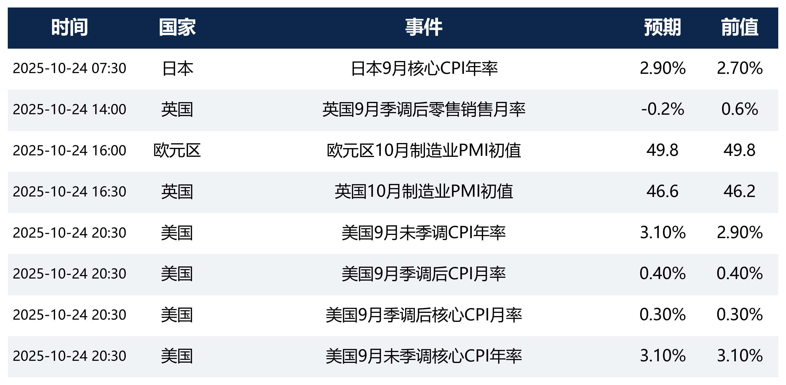

<h2 style="text-align:center; margin:0.2em 0;">早盘固收研报</h2>

<h3 style="border:5px solid #FFD700; display:inline-block; padding:4px 10px; border-radius:6px; margin:1em 0 0.6em; font-weight:700;">今日核心关注</h3>

隔夜美股上涨、欧股小幅收高，美债收益率上行4个基点至4.01%，国际油价大幅上涨3.99%；国内方面央行开展1680亿元逆回购操作，今日需重点关注晚间20:30美国9月CPI数据发布对全球债市的影响，预计早盘10年期国债收益率将受海外债市波动影响。

### 一、全球市场回顾

### 二、宏观要闻

#### :sparkles: 24小时内国内外新闻
1. 中国人民银行公开市场业务交易公告显示，2025年10月24日央行以1.40%的固定利率通过数量招标方式开展了1680亿元7天期逆回购操作，投标量与中标量均为1680亿元。
2. 据美国有线电视新闻网报道，美国政府自10月初开始的停摆切断了美联储获取官方经济数据的渠道，使其在劳动力市场疲软和通胀高企的背景下，面临仅剩一周的下次利率决策时陷入"盲判"困境。
3. 中国人民银行上海总部发布简报称，截至2025年9月末，境外机构持有银行间市场债券3.78万亿元，约占市场总托管量的2.2%，其中持有国债2.00万亿元占比最高达52.9%。
4. 国家外汇管理局公布数据显示，2025年9月银行结售汇顺差510亿美元，具体为结汇2647亿美元、售汇2136亿美元，发言人李斌表示当月外汇市场平稳运行且供求基本平衡。
5. 经国务院批准，财政部将于2025年11月3日当周在香港发行规模不超过40亿美元的美元主权债券，具体发行安排将在发行前公布。

#### :sparkles: 近三日国内外新闻
1. 中国人民银行公开市场业务交易公告显示，2025年10月22日央行以1.40%的固定利率通过数量招标方式开展了1382亿元7天期逆回购操作，投标量与中标量均为1382亿元。
2. 国家外汇管理局副局长李斌在答记者问中指出，2025年9月我国跨境资金流动活跃均衡，非银行部门跨境收支规模达1.37万亿美元、环比增长7%，但受季节性因素影响当月出现31亿美元小幅净流出。
3. 日本自民党总裁高市早苗于10月21日当选第104任首相，同期日元对美元汇率跌破150关口，市场担忧新政府或干预央行决策以延缓货币政策正常化。
4. 受美国联邦政府高赤字、债务问题及美联储开启降息通道影响，美元指数年初至今震荡走弱，2025财年财政赤字达1.775万亿美元。
5. 财政部通知显示将发行2025年记账式贴现（六十七期）国债，该期国债为91天贴现债，竞争性招标面值总额550亿元，计划于2025年10月23日计息、2026年1月22日偿还。

### 三、经济数据

